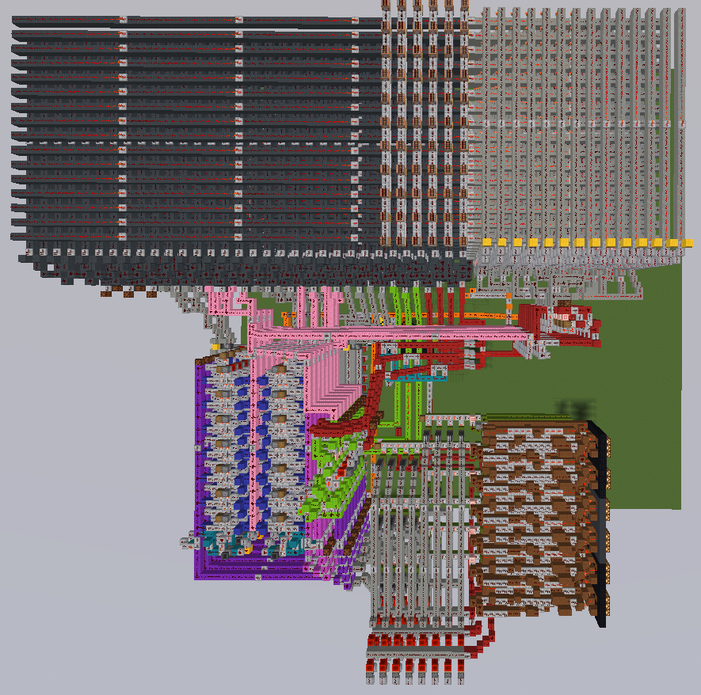

# Craft your IC - Assembler
An Assembler for our Minecraft CPU:

## Usage
- `make`: compile
- `make clean`: clean compile files
- `./assembler examples/my_assembly_file.s`: compile the assembly file
